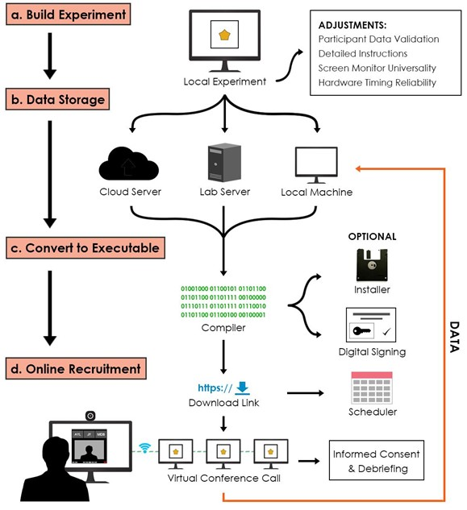
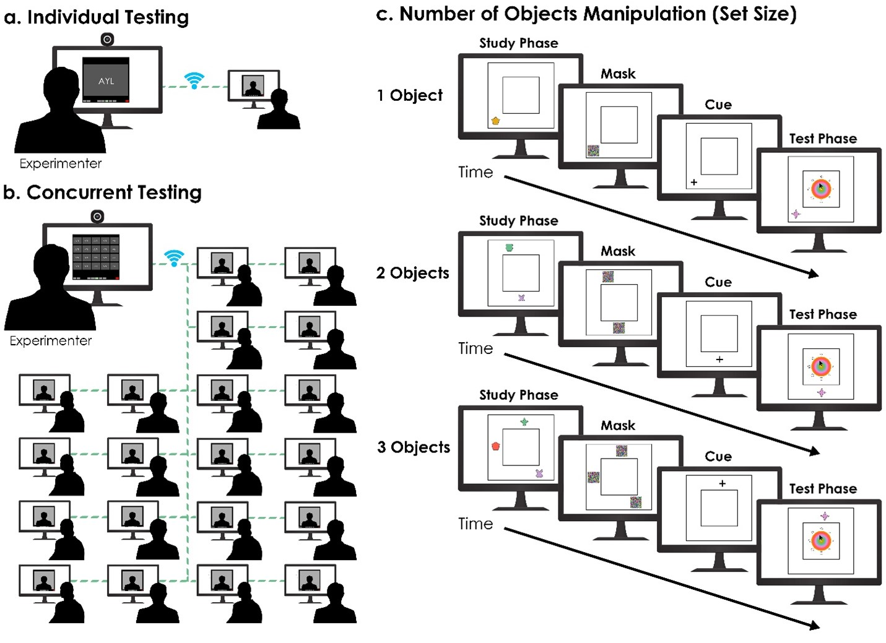

# Supplementary info and results

This page contains some more detailed background on the executable pipeline, as well as the description and results of several analyses we ran to validate its timing reliability. 

## The online executable pipeline

An existing local experiment is first converted into an executable file, which can then be downloaded by participants from anywhere in the world where there is Internet access. Much like how JavaScript files can be run in browsers, executable files can be downloaded and run by participant computers without the need to pre-install programs or toolkits. This means that, like browser-based experiments, executable-based experiments can be distributed widely and run by participants without strict software requirements. [See the executable development manual and demo, hosted in this repository.]

### Step A: Build experiment

We programmed the task using PsychoPy (Peirce et al., 2019), a Python-based package with functions to facilitate experimental design (e.g., stimulus presentation timings, recording key presses). In order to prepare the existing local code for online experimentation, we added several new components (Figure 1a). These additions are not necessarily only useful for an executable-based experiment but may also be useful for experimenters using other online-testing approaches.

Figure 1. An executable pipeline of online psychological testing. (a) The first step involves building a local experiment (e.g., using PsychoPy). Several adjustments to the experiment may be needed for testing participants online (see main text). (b) To store the data, options include cloud services (e.g., Dropbox) or a lab server. Alternatively, executables can save data to the participant's local machine, and participants can manually upload the data to a secure cloud service such as Dropbox. (c) To create the executable, open-source packages (e.g., PyInstaller) automatically compile the local experiment. To reduce concerns with installation and firewalls blocking the program, the experimenter can include an installer as well as digitally sign the program. (d) Finally, the executable can be downloaded, installed, and run by participants. In our study, participants ran the executable during a synchronous virtual conference (see paper for rationale), but this step could be completed asynchronously depending on the research question. 

#### Participant data validation

To prevent the experiment from being run twice by the same participant, we modified the code to generate a text file upon completion of the experiment and checked for the text file when the executable was run by the participant. If the text file was detected, the executable was terminated without running the experiment. The addition of this check ensured that participants could only run the experiment once on their machines. 

We also provided download links to participants that would expire after a single use, in order to discourage sharing of the experiment link to non-participants. Finally, we tracked participant data uploads using timestamps which could be paired with the time when a participant completed the experiment. Any data uploaded outside of a scheduled time could be excluded. 

#### Detailed instructions

Detailed pictures and instructions were included so that an experimenter would not be required to explain the procedure. A set of practice trials was also included into the executable file. We allowed participants to review instructions or practice trials repeatedly until they were confident in their understanding of the task. Although we did not choose to include this option, an experimenter could also provide a video or audio recording describing the task.

#### Screen monitor universality

Variability in participants' monitor resolutions could distort the appearance or cut off portions of the task. For this reason, the entire task was displayed within a square area measuring 1080 pixels by 1080 pixels, coded using absolute coordinates so that visual images were never stretched or distorted across different monitor resolutions. A monitor resolution of 1080 pixels by 1080 pixels were selected because 1920 x 1080 resolution was most common for participants (as observed during pilot testing at the University of Toronto). Participants with a screen resolution height of less than 1080 pixels were excluded from recruitment. 

### Step B: Data storage

Whereas local experiments save participant data directly onto a lab computer, online experiments must transfer data securely to the experimenter. Browser-based experiments typically accomplish secure data transfer by saving files onto the same webserver from which the experiment itself is hosted. Because executable files are downloaded and run locally on a participant computer rather than hosted on a webserver, an alternative method is necessary.

Data files were securely uploaded onto an online lab server through an encrypted connection once the participant completed the experiment. We anonymized the data, recording memory responses and general demographic information entered by participants. To track the upload, a random numerical identifier was appended to the name of each data file.

Though we have chosen to use an existing lab server, the experimenter may also consider cloud data storage services (Figure 1b). For example, data files can be transferred to a secure Dropbox server automatically upon completion of the experiment using the Dropbox SDK (https://pypi.org/project/dropbox/). As we designed the task to save a data file locally to the participant's computer, the simplest solution could involve the participant uploading the data file directly to Dropbox or even to a university email depending on the particular use case. However, researchers must carefully consider security and privacy concerns at this stage.

### Step C: Convert to executable

Once the experiment was modified to be suitable for online use (Figure 1a, b), the task was converted into an executable using a compiler (Figure 1c). These compilers (e.g., Pyinstaller, PyInstaller, n.d.; auto-py-to-exe, Vollebregt, n.d.) bundle all necessary external libraries or files, such as Python packages, and convert the main program into an executable form. The resulting program is standalone and requires neither a Python pre-installation nor any other external dependencies. In our case, the final product took the form of a ZIP folder containing the executable as well as folders containing system dependencies and other files used in the program such as stimulus images. We also included a few steps to facilitate sharing the executable with participants. To minimize false positives from an antivirus, we signed our executable file with a digital code signing certificate (e.g., Sectigo). Digital certificates are credentials linking the code from an executable to the developers, certifying that the code itself has not been modified by a third-party. 

We also used a free program, Advanced Installer (https://www.advancedinstaller.com/), to convert the ZIP file itself into a Windows installer, so that participants could extract the files with a single click rather than requiring participants to manually extract the file. In pilot testing, we found that a substantial portion of our participants did not correctly extract the ZIP file, an issue which was solved using the installer. The installer was uploaded to our lab server and shared with participants via one-time download links (Figure 1c).

As an initial proof-of-concept, we created executable files for only Windows operating systems. This decision was supported by an initial screening in the University of Toronto student pool, as the majority of undergraduate students owned Windows computers.

### Step D: Online recruitment

We recruited participants through the University of Toronto undergraduate pool for course credit as well as through the community for $10 CAD/hour. All participants were Windows users with monitor resolution heights of at least 1080 pixels, which was verified by pre-screen and verbally confirmed during the experiment. Participants could sign up for available meeting times with the experimenter through a scheduling application (e.g., Calendly). Participants were then emailed with a one-time link to download the executable installer and instructions. 

In Experiment 1a, all participants were scheduled for individual virtual conference rooms over Zoom, akin to individual participant testing in a local experiment. We chose to conduct the testing synchronously through a virtual conference room in order to ensure that participants were paying attention and that the process was similar to a traditional local experiment. This was an optional step intended to improve data quality, and the experimenter could alternatively choose to asynchronously test participants using executables without virtual conferencing. During the virtual conference room, we also conducted informed consent and debriefing. For this experiment, we restricted recruitment to the University of Toronto participant pool and the local community; future research should compare with more diverse sampling. Limiting the sample also allowed us to compare the data from online experimentation to previous data collected from the same population in the lab (Li et al., 2022).

During the scheduled time, we met with each participant virtually over Zoom (Figure 1d). We always verified each participant's eligibility and confirmed that the experiment had been downloaded and installed correctly. Once informed consent was collected, participants completed the experiment on their own computers with their camera and microphone muted. At the end of the experiment, we confirmed that the data was received on our lab server, debriefed participants, and provided compensation with course credit or e-Transfer payment as appropriate.

### Citations

Peirce, J., Gray, J. R., Simpson, S., MacAskill, M., Hochenberger, R., Sogo, H., Kastman, E., & Lindelov, J. K. (2019). PsychoPy2: Experiments in behavior made easy. Behavior Research Methods, 51(1), 195-203. https://doi.org/10.3758/s13428-018-01193-y

PyInstaller. (n.d.). PyInstaller Quickstart - PyInstaller Bundles Python Applications. Retrieved May 28, 2021, from https://www.pyinstaller.org/

Vollebregt, B. (n.d.). auto-py-to-exe: Converts .py to .exe using a simple graphical interface. Retrieved May 28, 2021, from https://github.com/brentvollebregt/auto-py-to-exe

## Timing reliability

To quantify variability in data quality introduced by differences in participant computer hardware, we assessed two quantitative measures of latency. The first measure tracked timing deviation, defined as the difference in time between the onset of the observed stimulus (i.e., when the participant actually saw the stimulus) and the onset of the expected stimulus (i.e., when the participant should have seen the stimulus). The second measure tracked graphical processing latency, defined as the number of dropped frames per second. We define a "dropped" frame as one which exceeds the normal frame time by 5 ms or more; thus, a high number of dropped frames suggests that a given computer had difficulty rendering the proper visual images. By dividing the total number of dropped frames by the time taken each trial, we quantified graphical processing latency as dropped frames per second. While we could not directly control the variability in processing speed across participants' computers, these measurements allowed us to capture a trial-by-trial index of both timing deviation and graphical processing latency and to compare participant hardware differences with data quality. 

Figure 2. Experiment 1 - Experimental Procedure. (a) Participants across both Experiment 1a (b) and Experiment 1b (c) studied to-be-remembered shape-color objects in three conditions (1 object, 2 objects, or 3 objects). During the study phase (2000 ms), participants studied either 1, 2, or 3 objects. A colored mask appeared to prevent visual afterimages, and then one of the objects were cued (target object). Participants reconstructed the shape and color features associated with the target object on the shape-color conjunction task (see main paper). We compared (b) individual testing in Experiment 1a, where a single participant completed the (a) task while they were in a virtual conference room with the experimenter, to (c) concurrent testing in Experiment 1b, where many participants completed the (a) task while they were in the same virtual conference room with the experimenter. In this way, we could examine whether the executable-based method of online psychological testing could replicate previous findings from the lab (Li, Fukuda, and Barense, 2022). Furthermore, we could directly examine the reliability and scalability between individual testing (Experiment 1a) and concurrent testing (Experiment 1b) over a virtual conference call (i.e., Zoom).  

### Experiment 1a: Individual participant testing

Here, we examined the efficacy of online executables when paired with visual conference rooms. Participants were scheduled for one-by-one virtual conference rooms, akin to a virtual version of local experimentation (i.e., individual testing). This served as a principled method to compare data quality between the executable during online experimentation with previous data collected during in-person local experimentation. We predicted that our results should directly replicate a memory effect previously observed in an in-person local experiment, whereby the resolution of shape-color object memory decreases as the number of objects to-be-remembered increases (i.e., a "set-size" effect; Li et al., 2022; Ma, Husain, and Bays, 2014).

#### Timing deviation

On average, both the timing deviation observed in participant computers and lab computers were reliable (in a 4.1 second trial, we observed less than 20 ms deviation in participant computers; and less than 60 ms deviation in lab computers, Figure 3a). Mean timing in Experiment 1 (M = 4.12 seconds, SD = 0.039) did not differ significantly from mean timing in the lab-based trials (M = 4.15 seconds, SD = 0.037); t33 = -1.94, p = .061, d = -0.939. That is, the inaccuracy in the observed timing of stimuli each trial was about equal for participant computers and for the lab computers. Interestingly, we observed a numerical trend whereby participant computers were more reliable in terms of timing compared to our lab computers which ranged from 2 - 5 years of age (Figure 3a). 

Figure 3. Reliability metrics. There was no difference between individual testing (Exp. 1a) or concurrent testing (Exp. 1b) in (a) timing deviation or (b) graphical processing latency, revealing that participant computers were highly reliable. In contrast, there was a significant difference between lab computers (n = 5) and participant computers, where lab computers had (a) greater timing deviation compared to participant computers. There was no correlation between fine-grained object responses (1-3 objects) with timing deviation (a-c) or graphical processing latency (f-h). These results confirm that participant computers were not only highly reliable in timing and graphical processing speed, but memory resolution was not related to participant hardware differences.

#### Graphical processing latency

On average, both participant computers and lab computers dropped about 10 frames per second (Figure 3b). Note that these dropped frames were measured specifically during a processing-heavy section of the experiment. Mean dropped frames per second in Experiment 1a (M = 10.79 FPS, SD = 5.11) did not differ significantly from the lab-based trials (M = 9.75 FPS, SD = 1.45), t33 = 0.45, p = .658. On this measure of latency, participant computers and lab computers did not differ from each other. 

### Experiment 1b: Concurrent participant testing

As Experiment 1a was conducted one-by-one with participants synchronously over Zoom (i.e., individual testing, Figure 2b), a method to test many participants concurrently would save time and effort when collecting data online (i.e., concurrent testing, Figure 2c). Furthermore, we wanted to demonstrate the test-retest reliability of this executable method of online experimentation. In order to determine whether executable-based experiments could be run simultaneously with many participants without losing data quality, we replicated Experiment 1a with many participants in the same virtual conference room in Experiment 1b. 

#### Timing deviation

Replicating Experiment 1a, the timing observed in participant computers in Experiment 1b was reliable. For a trial spanning 4100 ms, a deviation of less than 20 ms was observed on average, representing a variation across trials of less than 0.5%. We found a significant difference in mean time between Experiment 1a (M = 4.12 seconds, SD = 0.039), Experiment 1b (M = 4.11 seconds, SD = 0.025), and the lab-based trials (M = 4.15 seconds, SD = 0.037), F2, 62 = 3.41, p = .039, eta2 = .099. Post-hoc Tukey comparisons indicate a significantly faster mean difference between Experiment 1b and the lab-based trials (p = .030), but not between Experiment 1a and Experiment 1b (p = .813) or between Experiment 1a and the lab-based trials (p = .066). These results suggest that Experiment 1a and 1b did not differ in timing. In contrast, the lab computers had significantly higher timing deviation than participant computers in Experiment 1b, revealing that participants' home hardware outperformed our lab hardware in timing accuracy.

#### Graphical processing latency

We found no significant difference in graphical processing latency between Experiment 1a (M = 10.79 FPS, SD = 5.11), Experiment 1b (M = 9.45 FPS, SD = 5.27), and the lab-based trials (M = 9.75 FPS, SD = 1.45), F2, 62 = 0.55, p = .581, eta2 = .017.

#### Relationship between memory performance and hardware latency

Given the null findings between Experiment 1a and Experiment 1b in all measures of latency, we collapsed across both Experiment 1a and Experiment 1b to further examine the relationship between hardware latency and memory performance. More specifically, we correlated mean absolute shape-color error, proportion of fine-grained object responses, timing deviation, and graphic processing latency. As expected, the two measures of memory performance - mean absolute shape-color error and fine-grained object responses - were highly correlated, r58 = -.79, p < .001, r2 = .625. Similarly, the two measures of processing latency - timing deviation and graphical processing latency - were correlated, r58 = .38, p = .003, r2 = .142. No other correlations between these four measures were significant (Figure 3c-h, p > .20 for every correlation). These findings revealed that participant differences in visual memory resolution were not related to individual participant differences in computer hardware.
Overall, we found that the executable pipeline was reliable and scalable when paired with virtual Zoom conference rooms. Timing quality was satisfactory in our use case and sometimes even superior compared to timing on the lab equipment.

### Task procedure

#### Participants

Thirty participants, all Windows users, were recruited from the undergraduate student pool at the University of Toronto and from the community (Mage = 21.97 years, SDage = 4.90 years, Females = 20). Participants recruited from the undergraduate student pool received course credit; community members were compensated with $10/hour CAD. REB approval was received from the University of Toronto (Protocol 38856).	

#### Apparatus and stimuli

The experiment was programmed in Python using PsychoPy and converted into an executable using the pipeline described in the previous section Executable Pipeline. All participants were using a computer or laptop with Windows OS (Windows 7 or later) and with a monitor height of at least 1080 pixels. 

#### Procedure

In Experiment 1a, participants were scheduled for individual virtual conference rooms over Zoom with an experimenter (Figure 2b). Before beginning the experiment, we collected informed consent from participants, verified their eligibility of monitor size and operating system, and troubleshooted possible errors in downloading or installing the executable file. After starting the program, participants read through instructions and completed practice trials; the instructions and practice trials could be repeated as many times as necessary. Participants were also asked to avoid naming the shape-color objects or using other verbal strategies during the experiment. 

Before the beginning of each trial, participants were shown a screen indicating the current trial number and instructed to press the enter key to begin the trial. A static background of two nested squares was displayed to participants, the larger of which was 1080 pixels in width and height. This was the bounding area of the experiment, with study objects always appearing between the two squares, and with responses made within the center square (Figure 2a). 

##### Study phase

After a delay of 500 ms, shape-color objects were displayed for 2000 ms. Each trial included a condition with either one, two, or three objects, with 20 trials of each condition displayed in a random order for each participant. Objects only appeared in the track bounded by the two background squares shown in Figure 2a. Each shape was sampled from VCS space (Li, Liang, Lee, and Barense, 2020), and a fill color was derived from a circle defined on CIELAB color space (L = 70, a = 20, b = 38, radius = 60; Zhang and Luck, 2008). For each set of objects, shapes and colors were selected by sampling from a random set of six equidistant points along circular shape and color space. 

##### Mask and delay

After a 300 ms ISI, square colored masks consisting of a 50x50 checkerboard pattern of random colors were displayed over the previous locations of the objects for 300 ms, intended to minimize visual afterimages. Following this mask, a delay period of 1000 ms occurred, in which nothing other than the background was shown. By this point, 4.1 seconds have elapsed in the trial, and we used this timing as a benchmark for a measure of timing deviation (see section Statistical Analysis. Reliability).

##### Cue

After the delay, a fixation cross was displayed for 500 ms at the location of the target object whose shape and color were to be reconstructed by the participant. 

##### Test phase

Finally, the shape-color conjunction task appeared (see main paper), centered within the inner background square (Figure 2a). Participants reconstructed memory resolution for the target object's shape and color (for a visual example, see the Open Science Framework: https://osf.io/a4vsb/). 

Participants could move the mouse cursor around the circumference of a 2D circle to reconstruct shapes from circular shape space (i.e., VCS space) and around the radius to reconstruct colors from circular color space (i.e., CIELAB space). As participants moved their mouse along x and y coordinates on the task, a reconstructed object (shape and color) was displayed continuously along shape and color space. Importantly, the shape-color conjunction task is more sensitive than yes/no measures of memory, as the exact shape-color object held in memory could be reconstructed by participants. Reconstructed shapes or colors that were closer in distance on VCS and CIELAB spaces were more similar to the target than shapes or colors further in distance, and we used this property of circular space as an index of memory resolution (for a more detailed description, see Li, Liang, Lee, and Barense, 2020; and Li et al., 2022).	

After reconstructing a shape-color object, participants could fine-tune their response using the arrow keys (adjusting color using the up and down keys, and shape using the left and right keys). Pressing the enter key completed the trial, and participants were then shown the trial number for the next trial. Participants were allotted an optional 5-minute break halfway through the experiment.

The overall experiment included 60 trials and lasted about 30 minutes. When the experiment was completed, the data was uploaded to our lab server. The experiment exited automatically, and participants were debriefed verbally, provided with instructions to uninstall the experiment, and compensated with course credit or e-Transfer as appropriate.

## Citations

Li, Fukuda, K., & Barense, M. (2021). Independent features form integrated objects: Using a novel shape-color "conjunction task" to reconstruct memory resolution for multiple object features simultaneously. PsyArXiv. https://doi.org/10.31234/osf.io/szjr3

Ma, W. J., Husain, M., & Bays, P. M. (2014). Changing concepts of working memory. Nature Neuroscience, 17(3), 347-356. https://doi.org/10.1038/nn.3655

